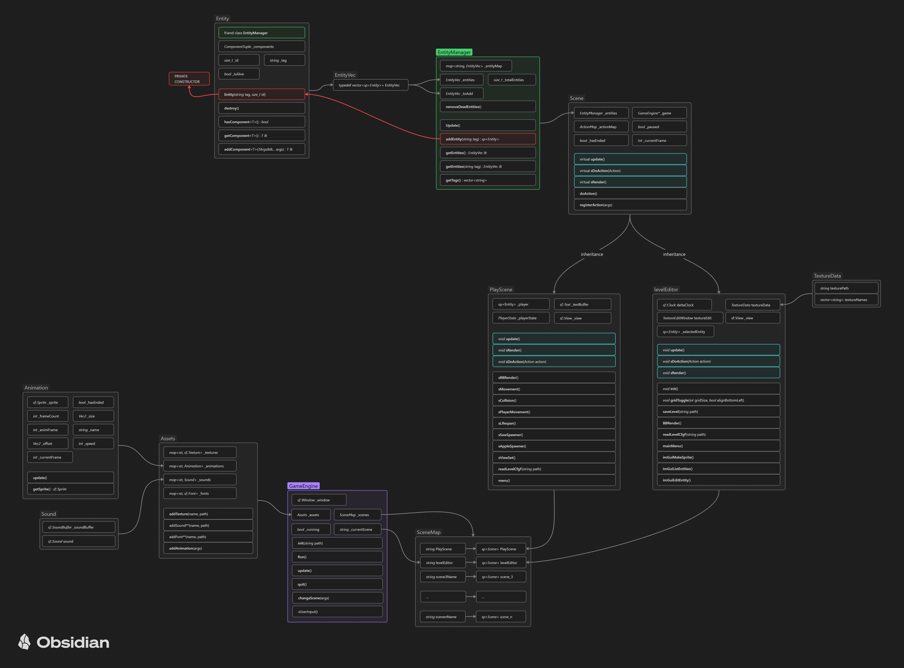

&nbsp;&nbsp;&nbsp;

### EasyEngine is an ongoing project aimed at creating a game engine for fast prototyping of 2D games.

---
**As I have gained experience with commercial engines, I have identified some mistakes I made during the development of this project. My current goal is to address these mistakes and also adjust the scope of the project slightly.**

**I am also migrating the project from SFML to Raylib, as Raylib seems better suited for rapid prototyping due to its ease of use. The Raylib version of the project is currently hosted on a dedicated branch in the repository. This version is unfinished and does not yet include a level editor. I am actively working to bring it to the same state as the SFML version.**

---

The motivation for this project was my idea to build a videogame, and a subsequent realization that it takes a lot to make even a simple prototype. I decided that a good place to start learning about game development is to build an engine that allows for the creation of prototypes very quickly and test the idea before jumping into professional engines.

The engine is built with C++20 and SFML and uses the ECS design pattern. The core engine features are based on a 2023 lecture series on game programming from the Memorial University by Dave Churchill [(link)](https://www.youtube.com/watch?v=s99UDGdYIUE&list=PL_xRyXins84_Jf-aCh7chj47HR4oZLPwK&pp=iAQB).

Below is a graph representing the overall architecture of the engine:

## Building
The project uses Visual Studio 2022 for it's build system. You can just open the solution file and build.
Make sure the target platform is set to x86.

## Milestones
- [x] core engine features
- [x] basic level editor
- [ ] capable editor (for static elements)
- [ ] better physics
- [ ] simple in game windowing system

## TODO TILL NEXT MILESTONE

- [x] edit components in the editor
- [x] edit sprites in the editor
- [x] save/read the level using a config file
- [ ] save/read created sprites using a config file
- [x] control over the view in the editor
- [x] make the UI more structured
- [x] intuitive mouse controls in the editor
