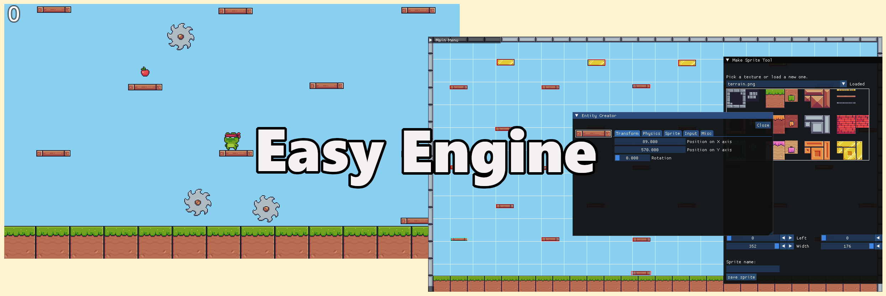
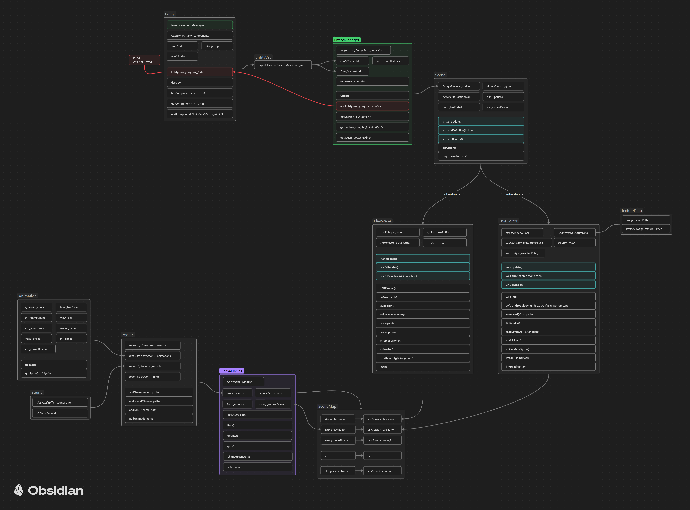

&nbsp;&nbsp;&nbsp;


### EasyEngine is an ongoing project aimed at creating a game engine for fast prototyping of 2D games.


The engine is built with C++ and raylib, and uses the ECS design pattern.

Below is a graph representing the overall architecture of the engine:


## Building
Make sure you clone the repository with the ```--recursive``` 
flag to clone the raylib submodule.

The project uses CMake for it's build system.
Create a build directory and call cmake on the top folder and ```cmake --build``` in the build folder.
The assets should be copied to the parent folder of the 
game binaries. If that is not the case, 
you will have to do that manually (currently the project is centered around a demo
of a simple game. It is not ready for a standalone version yet.).

It works on both Windows and Linux (requires xorg-dev and libx11-dev packages on Linux to build GLFW).

## Usage
The engine is ment to be used in code, except for the level editor which 
will allow you to change a scene and its layout graphically. You can always use the demo game scene
 "PlayScene" as 
an example, to see how you can structure a scene in your game.

In general, you need ```update(), sRender() and sDoAction()``` functions in every scene you make. Your scene should inherit from the general Scene class and override those functions. See PlayScene for an example. The ```init()``` function of a scene shoud register actions with keys (from the keyboardKeys enum in raylib) using ```registerAction()``` function and read a level config file (where all the entities are defined as created in the level editor) with ```readLevelCfgF(str path)```. The ```update()``` function is used to call all your custom game systems. The ```sDoAction()``` function is used to define all actions (see PlayScene).

#### Unfinished elements to keep in mind:
At the moment, there are some elements of the engine that are not yet fixed after migration to raylib. Here's some of them:
- GameEngine::sUserInput() -
a method that sends user input to the scene and calls actions in sDoAction. It will probably work for you, but it's a temporary system that you might have to expand upon if things don't work the way you expect. If you have a problem with the inputs, this is a good place to start investigating.

## Milestones
- [x] core engine features
- [x] basic level editor
- [ ] capable editor (for static elements)
- [ ] better physics
- [ ] UI system

## TODO UNTILL THE NEXT MILESTONE

- [x] edit components in the editor
- [x] edit sprites in the editor
- [x] save/read the level using a config file
- [ ] save/read created sprites using a config file
- [x] control over the view in the editor
- [x] make the UI more structured
- [x] intuitive mouse controls in the editor
