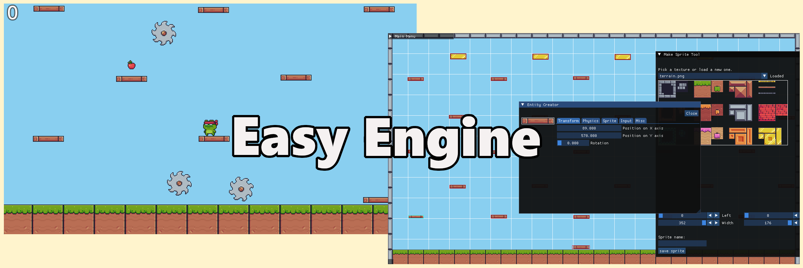

&nbsp;&nbsp;&nbsp;

### EasyEngine is an ongoing project aimed at creating a game engine for fast prototyping of 2D games.

The motivation for this project was my idea to build a videogame, and a subsequent realization that it takes a lot to make even a simple prototype. I decided that a good place to start learning about game development is to build an engine that allows for the creation of prototypes very quickly and test the idea before jumping into professional engines.

The engine is built with C++20 and SFML and uses the ECS design pattern. The core engine features are based on a 2023 lecture series on game programming from the Memorial University by Dave Churchill [(link)](https://www.youtube.com/watch?v=s99UDGdYIUE&list=PL_xRyXins84_Jf-aCh7chj47HR4oZLPwK&pp=iAQB).

---

I'm considering migrating the project from SFML to Raylib as it seems to be more aligned with the idea of fast prototyping due to its ease of use.
Currently, a Raylib version of the project is hosted on its own dedicated branch in the repo.
This version is unfinished and does not yet include a level editor. 
I am working to bring it up to the same state as the SFML version, after which I will decide which one I will continue to work with.

---

Below is a graph representing the overall architecture of the engine:

## Building
The project uses Visual Studio 2022 for it's build system. You can just open the solution file and build.
Make sure the target platform is set to x86.

## Milestones
- [x] core engine features
- [x] basic level editor
- [ ] capable editor (for static elements)
- [ ] better physics
- [ ] ability to add premade systems to scenes
- [ ] simple in game windowing system

## TODO TILL NEXT MILESTONE

- [x] edit components in the editor
- [x] edit sprites in the editor
- [x] save/read the level using a config file
- [ ] save/read created sprites using a config file
- [x] control over the view in the editor
- [x] make the UI more structured
- [x] intuitive mouse controls in the editor
